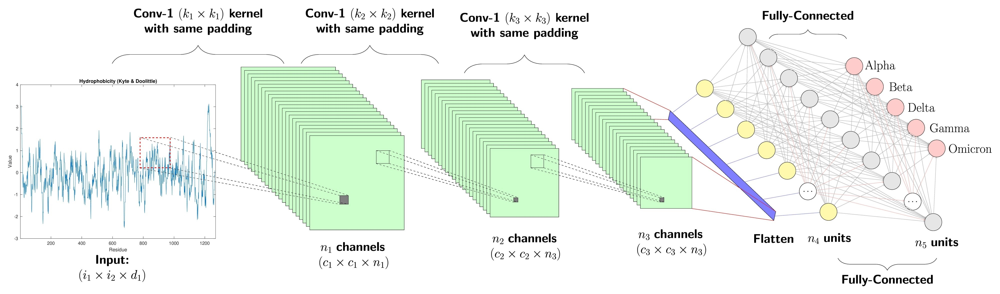

# 🎭 Face Emotion Recognition System (Deep Learning)

Proyek ini adalah sistem pengenalan emosi wajah manusia yang dibangun menggunakan kerangka kerja **PyTorch**. Sistem ini mampu mengklasifikasikan wajah ke dalam 7 kategori emosi:
- 😠 **Angry** (Marah)
- 🤢 **Disgust** (Jijik)
- 😨 **Fear** (Takut)
- 😊 **Happy** (Bahagia)
- 😐 **Neutral** (Netral)
- 😢 **Sad** (Sedih)
- 😮 **Surprise** (Terkejut)

Proyek ini mengimplementasikan teknik **Transfer Learning** menggunakan tiga arsitektur State-of-the-Art (SOTA) untuk membandingkan performa terbaik: **ResNet-18**, **EfficientNet-B0**, dan **MobileNet-V2**.

### Arsitektur Model



*Gambar: Alur data melalui jaringan konvolusi multi-layer dan fully connected layers untuk klasifikasi 7 emosi*

---

## 🚀 Fitur Utama

✨ **Multi-Model Comparison**  
Evaluasi performa antara ResNet, EfficientNet, dan MobileNet untuk menemukan model terbaik.

🔄 **Dynamic Fine-Tuning**  
Implementasi pengaktifan layer (unfreezing) secara bertahap selama pelatihan untuk hasil optimal.

⚡ **Advanced Callbacks**  
Penggunaan Early Stopping untuk mencegah overfitting dan Learning Rate Scheduler untuk optimasi konvergensi.

📸 **Data Augmentation**  
Transformasi gambar (crop, flip, rotation) untuk meningkatkan daya generalisasi model.

---

## 📦 Instalasi & Dependensi

### Prasyarat
Pastikan Anda memiliki **Python 3.8+** dan lingkungan virtual aktif.

### Instalasi Paket
Instal pustaka yang diperlukan dengan menjalankan perintah berikut:

```bash
pip install torch torchvision torchaudio matplotlib pandas numpy tqdm pillow
```

### GPU Support (Opsional tapi Disarankan)
Jika Anda menggunakan GPU, pastikan driver **CUDA** sudah terinstal agar PyTorch dapat berjalan dengan akselerasi perangkat keras:

```bash
# Untuk CUDA 11.8
pip install torch torchvision torchaudio --index-url https://download.pytorch.org/whl/cu118
```

---

## 🛠️ Alur Kerja & Penjelasan Kode

Alur logika dalam notebook `UAS_Pengenalan_Pola.ipynb` dibagi menjadi beberapa tahap kunci:

### 1️⃣ Preprocessing Data

Data dimuat menggunakan `torchvision.datasets.ImageFolder`. Karena dataset emosi wajah (seperti FER-2013) seringkali memiliki variasi pencahayaan, kita menerapkan transformasi berikut:

- **Resize & CenterCrop**: Menyeragamkan ukuran input menjadi 224×224 piksel
- **RandomHorizontalFlip**: Menambah variasi data secara sintetis
- **Normalize**: Menyesuaikan distribusi piksel dengan standar ImageNet

```python
transforms.Compose([
    transforms.Resize((224, 224)),
    transforms.CenterCrop(224),
    transforms.RandomHorizontalFlip(),
    transforms.ToTensor(),
    transforms.Normalize(mean=[0.485, 0.456, 0.406], 
                         std=[0.229, 0.224, 0.225])
])
```

### 2️⃣ Arsitektur Model (Transfer Learning)

Model tidak dibangun dari nol, melainkan menggunakan bobot yang sudah terlatih (**pre-trained weights**).

- **Backbone**: Lapisan ekstraksi fitur dibekukan (`requires_grad = False`) pada tahap awal
- **Classifier**: Lapisan terakhir (fully connected layer) diubah untuk menyesuaikan jumlah kelas output menjadi **7 emosi**

```python
model = models.resnet18(pretrained=True)
# Freeze backbone
for param in model.parameters():
    param.requires_grad = False

# Replace classifier
num_classes = 7
model.fc = nn.Linear(model.fc.in_features, num_classes)
```

### 3️⃣ Strategi Pelatihan (Training Logic)

Sistem menggunakan fungsi `train_model_with_callbacks` yang memiliki logika dua fase:

**Phase 1 (Warm-up)**  
Hanya melatih lapisan classifier baru dengan learning rate yang lebih tinggi.

**Phase 2 (Fine-tuning)**  
Membuka kunci (unfreeze) lapisan backbone setelah beberapa epoch agar model dapat mempelajari fitur spesifik dari dataset wajah.

**Optimizer**: Adam dengan learning rate adaptif

### 4️⃣ Evaluasi & Visualisasi

Setelah pelatihan selesai, kode akan menghasilkan:

- **Loss & Accuracy Curves**: Grafik perbandingan performa antara data latih dan data validasi
- **Confusion Matrix**: Melihat emosi mana yang paling sering salah diprediksi oleh model
- **Classification Report**: Metrik precision, recall, dan F1-score untuk setiap emosi

---

## 📊 Hasil Eksperimen

Berdasarkan pengujian, berikut adalah ringkasan akurasi terbaik yang dicapai:

| Model | Akurasi Validasi |
|-------|-----------------|
| **ResNet-18** | 62.08% |
| **EfficientNet-B0** | Lihat Log Notebook |
| **MobileNet-V2** | Lihat Log Notebook |

**Catatan**: ResNet-18 menunjukkan stabilitas terbaik dalam menangani dataset ini dibandingkan arsitektur lainnya. Model memiliki keseimbangan yang baik antara akurasi dan kecepatan komputasi.

---

## 📂 Struktur Folder

```
Face Emotion Recognition System/
├── UAS_Pengenalan_Pola.ipynb    # Notebook utama dengan seluruh pipeline
├── code.ipynb                   # Notebook tambahan / eksperimen
├── README.md                    # Dokumentasi ini
├── dataset/
│   ├── train/                   # Data pelatihan
│   │   ├── angry/
│   │   ├── disgusted/
│   │   ├── fearful/
│   │   ├── happy/
│   │   ├── neutral/
│   │   ├── sad/
│   │   └── surprised/
│   └── test/                    # Data pengujian
│       ├── angry/
│       ├── disgusted/
│       ├── fearful/
│       ├── happy/
│       ├── neutral/
│       ├── sad/
│       └── surprised/
```

---

## 🎯 Cara Menggunakan

### 1. Persiapan Dataset
Pastikan dataset sudah tersimpan di folder `dataset/` dengan struktur:
```
dataset/
├── train/
│   └── [emotion]/ → [image1.jpg, image2.jpg, ...]
└── test/
    └── [emotion]/ → [image1.jpg, image2.jpg, ...]
```

### 2. Menjalankan Notebook
Buka notebook `UAS_Pengenalan_Pola.ipynb` di Jupyter atau JupyterLab:

```bash
jupyter notebook UAS_Pengenalan_Pola.ipynb
```

### 3. Jalankan Setiap Cell Secara Berurutan
- **Cell 1-5**: Setup environment dan import library
- **Cell 6-10**: Load dan visualisasi data
- **Cell 11-15**: Inisialisasi dan train model
- **Cell 16-20**: Evaluasi dan visualisasi hasil

---

## 📈 Metrik Evaluasi

Sistem menggunakan metrik berikut untuk mengevaluasi performa:

- **Accuracy**: Persentase prediksi yang benar
- **Precision**: Dari prediksi positif, berapa yang benar
- **Recall**: Dari label sebenarnya, berapa yang terdeteksi
- **F1-Score**: Harmonic mean dari precision dan recall
- **Confusion Matrix**: Matrik untuk melihat kesalahan klasifikasi

---

## 💡 Tips & Trik

### Meningkatkan Akurasi
1. Kumpulkan lebih banyak data (data augmentation)
2. Tuning hyperparameter (learning rate, batch size, epochs)
3. Coba arsitektur model yang lebih kompleks
4. Gunakan ensemble dari beberapa model terbaik

### Mempercepat Training
1. Aktifkan GPU dengan PyTorch
2. Gunakan model yang lebih lightweight (MobileNet-V2)
3. Kurangi ukuran batch jika memory terbatas
4. Kurangi jumlah epoch atau gunakan early stopping

---

## 📚 Referensi & Resources

- [PyTorch Documentation](https://pytorch.org/docs/stable/index.html)
- [Torchvision Models](https://pytorch.org/vision/stable/models.html)
- [FER-2013 Dataset](https://www.kaggle.com/datasets/msambare/fer2013)
- [Transfer Learning Tutorial](https://pytorch.org/tutorials/beginner/transfer_learning_tutorial.html)

---

## 👨‍💼 Author & Lisensi

Proyek ini dibuat sebagai bagian dari studi Deep Learning dan Computer Vision.

**Lisensi**: MIT (Bebas digunakan untuk keperluan akademis dan komersial)

---

## 📧 Kontak & Support

Jika ada pertanyaan atau saran, silakan buat issue di repository ini atau hubungi kami melalui email.

**Happy Learning! 🚀**
